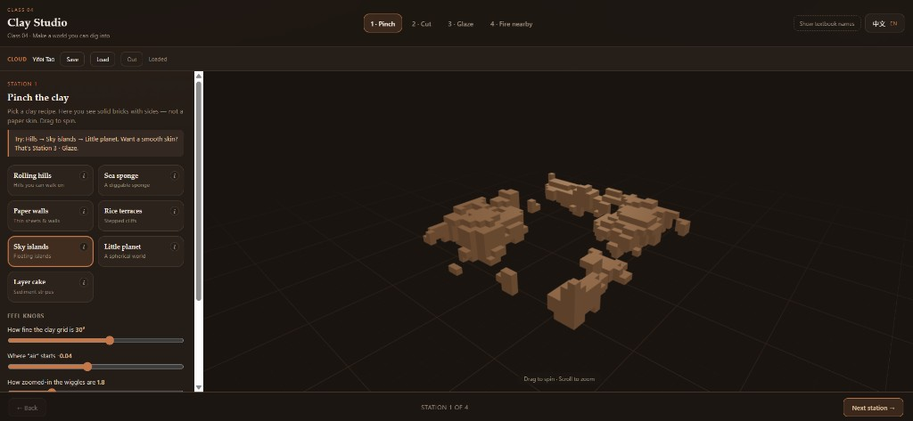

# Procedural World Building

This is a repo for **Design 4197-6197: Special Topics in Design 2026 — Procedural World Building**. This is Yifei Tao (Ella)'s repo. I will keep updating my progress, assignments, experiments, and notes here throughout the semester.

---

## Weekly log

Newest first. Each entry is a short snapshot of what I explored that week.

### 2026-09 · Class 04 — Clay Studio (voxels → clear UI → Firebase)

Explored **voxel / density** experiments from lecture, then reshaped them into a simpler, beginner-friendly **Clay Studio** app (pinch · cut · glaze · fire nearby). Deployed to **Firebase Hosting** with **Google sign-in** and **save / load** of studio settings via **Firestore**.



- App: [`class_04/react-app-ts/`](class_04/react-app-ts/)  
- Live: [https://pwb-class04-clay.web.app](https://pwb-class04-clay.web.app)  
- Notes: [`class_04/tutorials/`](class_04/tutorials/)

---

## Repo Structure

```
Pwb_yt684_fa26/
├── class_XX/                  # One folder per class session
│   ├── react-app-ts/          # In-class React + TypeScript exercise app
│   └── tutorials/             # Markdown notes and walkthroughs for that session
├── final-project/             # Semester final project (separate app, separate deployment)
│   ├── src/
│   ├── package.json
│   └── vite.config.ts
├── docs/
│   ├── weekly/                # Screenshots + short weekly log images
│   ├── planning/              # Plans and schedules
│   ├── tutorials/             # Shared notes across sessions
│   └── analysis/              # Readings, case studies, and reflections
├── BACKLOG.md                 # Features and experiments to try
└── README.md
```

---

## Conventions

### Monorepo layout

This repo follows a **monorepo** structure: all class exercises and the final project live here in one place, but each is a fully independent app with its own `package.json` and `node_modules`. They share the same git history and notes, but are deployed separately.

### Class sessions (`class_XX/`)

Each class session gets its own top-level folder named `class_XX` (e.g. `class_02`).

| Sub-folder | Purpose |
| --- | --- |
| `react-app-ts/` | The in-class React + TypeScript + Three.js exercise app |
| `tutorials/` | Markdown notes written during or after the session |

Run a class exercise locally:
```bash
cd class_02/react-app-ts
npm install
npm run dev
```

### Final project (`final-project/`)

The semester final project lives in its own top-level folder. It is a separate Vite + React + TypeScript app, independent of any class exercise. When ready, it will be deployed to its own URL.

Run the final project locally:
```bash
cd final-project
npm install
npm run dev
```

### Deployments

Each app is deployed independently (e.g. via Vercel or Firebase Hosting) by pointing at that app's folder. This means each app gets its own URL:

| App | Root Directory | Purpose |
| --- | --- | --- |
| Class exercises | `class_XX/react-app-ts` | Weekly in-class work |
| Final project | `final-project` | Semester final |

### Tech stack

- **React 19** + **TypeScript 6** via **Vite 8**
- **Three.js** with **React Three Fiber** and **Drei**
- **Firebase** (Auth · Firestore · Hosting) for class cloud demos
- Version control: **Git** + **GitHub**

---

## Docs

| File / Folder | What's inside |
| --- | --- |
| [BACKLOG.md](BACKLOG.md) | Features and experiments to try |
| [docs/weekly](docs/weekly) | Weekly screenshots for the log above |
| [docs/planning](docs/planning) | Plans and schedules |
| [docs/analysis](docs/analysis) | Readings, case studies, and reflections |
