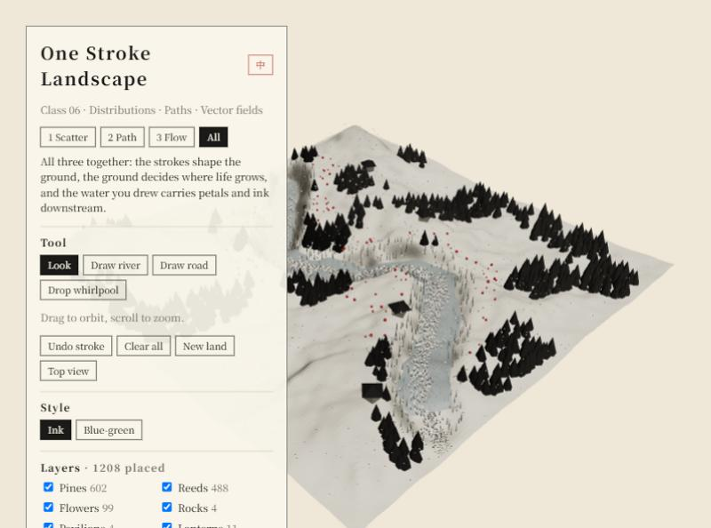
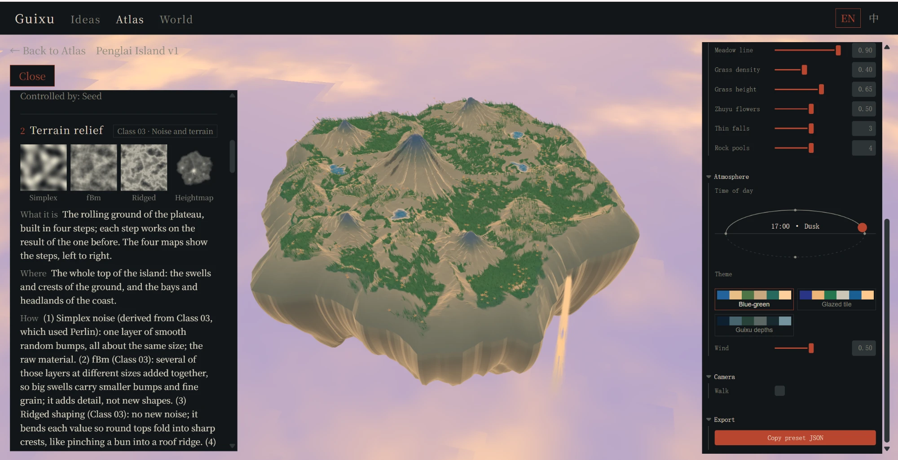
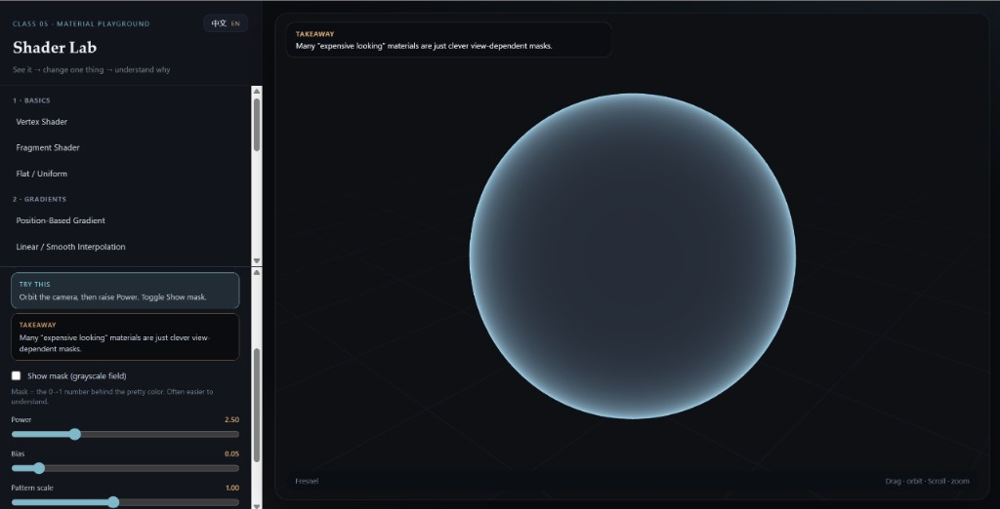
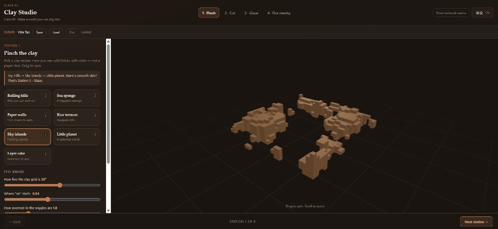

# Procedural World Building

This is a repo for **Design 4197-6197: Special Topics in Design 2026 — Procedural World Building**. This is Yifei Tao (Ella)'s repo. I will keep updating my progress, assignments, experiments, and notes here throughout the semester.

---

## Weekly log

Newest first. Each entry is a short snapshot of what I explored that week.

### 2026-10 · Class 06 — One Stroke Landscape 一笔山河 (scatter · paths · vector fields)

One interactive piece for the three assignments of the class (distributions, paths, vector fields and particles). Draw a stroke on an empty landscape: it becomes a **river** that carves the ground (or a **road** that levels it and gets lanterns); life **regrows around it by rules**; and the water you drew **flows**, carrying thousands of particles that leave brush-stroke trails. Four chapters (Scatter · Path · Flow · All), ink-wash and blue-green styles, EN/中文.

- **Scatter**: one rule layer per asset, reading height, slope, moisture and distance to water and road: rocks only on cliffs, reeds on banks, pines in clumps on gentle slopes (smaller up high, greener where wet), flowers on wet flat ground, pavilions on the flattest high spots, lanterns along roads.
- **Path**: mouse points → Catmull-Rom spline → draped on the terrain; the line carves or levels the mesh, and the mesh's moisture moves the vegetation.
- **Flow**: a vector field summed from the river current (in the drawn direction), whirlpools you drop, and curl-noise wind; particles read it every frame and draw fading trails.
- **AI workflow**: rebuilt from scratch with Claude Code after a first version felt dull and hard to use: I chose the concept (one integrated piece in three chapters) and the priorities (clear concepts, smooth, not over-detailed), and tested the interactions.



- App: [`class_06/react-app-ts/`](class_06/react-app-ts/)  
- Notes: [`class_06/tutorials/One Stroke Landscape.md`](class_06/tutorials/One%20Stroke%20Landscape.md)

### 2026-09 · Final project — Guixu 归墟: Penglai Island v1 (first floating island)

Started the final project: **Guixu**, five floating mountains above a sea of cloud and the bottomless abyss beneath them, drawn from the *Liezi* and the *Shanhaijing*, colored after blue-green landscape painting, lit like *Sky*. Built the site (Ideas · Atlas · World, EN/中文) and the first island study, **Penglai**, where everything is generated from rules and a seed:

- **Terrain**: Simplex noise → fBm → ridged shaping → heightmap; natural stone peaks from distance masks, merged by smooth union and painted ochre → malachite → azurite per peak.
- **Underside**: the same heightmap idea hung upside down: a cliff wall and a few blunt hanging rocks.
- **Water**: thin falls (noise streaks sliding down in a shader) and rock pools carved into hollows (Fresnel reflection of the sky).
- **Life**: instanced grass bending in one shared wind; *Zhuyu* flowers that open by day and glow at night.
- **Look and feel**: three palettes (blue-green, glazed tile, Guixu depths), a warm-gold and lavender cloud sea, a draggable sun, and a first-person **walk** (WASD) across the island.
- **Techniques panel**: every step explained (what / where / how) with its class source and a live map.

**AI workflow**: Claude Code as the builder, me as author and critic. A handover doc set the rules (everything procedural, plan before code, measure every change); each round I reviewed screenshots, drew corrections on them (for example the underside went from "knife cuts" to a twisted stem to an "upside-down cactus" before landing on blunt hanging rocks), and asked for the principle behind each technique so I can explain it. Every change and its measurements are logged in the project notes.

**Next**: wind as a real vector field (Session 6), L-system pines (Session 7), seasons driven by the 24 solar terms, and the other four islands.



- App: [`final_project/`](final_project/)  
- Live: [https://guixu-yt684.web.app](https://guixu-yt684.web.app)  
- Notes: [`final_project/src/experiments/island-v1/notes.md`](final_project/src/experiments/island-v1/notes.md) · World concept: [`final_project/docs/world-concept.md`](final_project/docs/world-concept.md)

### 2026-09 · Class 05 — Shader Lab (see → tweak → understand)

Built a **Shader Lab** playground for class shader studies: vertex / fragment / uniforms, gradients, Fresnel, slope, distance, AO, contact, matcap, displacement, and a final combo. EN/中文 UI, “try this / takeaway / show mask,” and a suggested learning path — more material laboratory than documentation site.



- App: [`class_05/react-app-ts/`](class_05/react-app-ts/)  
- Notes: [`class_05/tutorials/Shader Lab.md`](class_05/tutorials/Shader%20Lab.md)

### 2026-09 · Class 04 — Clay Studio (voxels → clear UI → Firebase)

Explored **voxel / density** experiments from lecture, then reshaped them into a simpler, beginner-friendly **Clay Studio** app (pinch · cut · glaze · fire nearby). Deployed to **Firebase Hosting** with **Google sign-in** and **save / load** of studio settings via **Firestore**.



- App: [`class_04/react-app-ts/`](class_04/react-app-ts/)  
- Live: [https://pwb-class04-clay.web.app](https://pwb-class04-clay.web.app)  
- Notes: [`class_04/tutorials/`](class_04/tutorials/)

---

## Repo Structure

```
Pwb_yt684_fa26/
├── class_XX/                  # One folder per class session
│   ├── react-app-ts/          # In-class React + TypeScript exercise app
│   └── tutorials/             # Markdown notes and walkthroughs for that session
├── final_project/             # Semester final project: Guixu (separate app, separate deployment)
│   ├── src/
│   ├── package.json
│   └── vite.config.ts
├── docs/
│   ├── weekly/                # Screenshots + short weekly log images
│   ├── planning/              # Plans and schedules
│   ├── tutorials/             # Shared notes across sessions
│   └── analysis/              # Readings, case studies, and reflections
├── BACKLOG.md                 # Features and experiments to try
└── README.md
```

---

## Conventions

### Monorepo layout

This repo follows a **monorepo** structure: all class exercises and the final project live here in one place, but each is a fully independent app with its own `package.json` and `node_modules`. They share the same git history and notes, but are deployed separately.

### Class sessions (`class_XX/`)

Each class session gets its own top-level folder named `class_XX` (e.g. `class_02`).

| Sub-folder | Purpose |
| --- | --- |
| `react-app-ts/` | The in-class React + TypeScript + Three.js exercise app |
| `tutorials/` | Markdown notes written during or after the session |

Run a class exercise locally:
```bash
cd class_02/react-app-ts
npm install
npm run dev
```

### Final project (`final_project/`)

The semester final project, **Guixu**, lives in its own top-level folder. It is a separate Vite + React + TypeScript app, independent of any class exercise, deployed to its own URL: [https://guixu-yt684.web.app](https://guixu-yt684.web.app).

Run the final project locally:
```bash
cd final_project
npm install
npm run dev
```

### Deployments

Each app is deployed independently (e.g. via Vercel or Firebase Hosting) by pointing at that app's folder. This means each app gets its own URL:

| App | Root Directory | Purpose |
| --- | --- | --- |
| Class exercises | `class_XX/react-app-ts` | Weekly in-class work |
| Final project | `final_project` | Semester final ([guixu-yt684.web.app](https://guixu-yt684.web.app)) |

### Tech stack

- **React 19** + **TypeScript 6** via **Vite 8**
- **Three.js** with **React Three Fiber** and **Drei**
- **Firebase** (Auth · Firestore · Hosting) for class cloud demos
- Version control: **Git** + **GitHub**

---

## Docs

| File / Folder | What's inside |
| --- | --- |
| [BACKLOG.md](BACKLOG.md) | Features and experiments to try |
| [docs/weekly](docs/weekly) | Weekly screenshots for the log above |
| [docs/planning](docs/planning) | Plans and schedules |
| [docs/analysis](docs/analysis) | Readings, case studies, and reflections |
